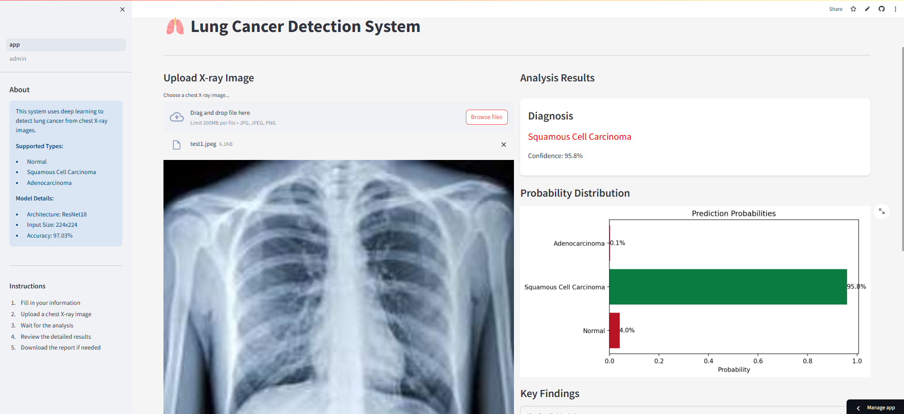
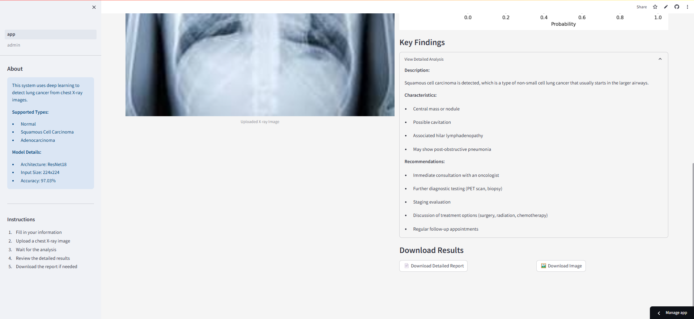

# LungScan-AI

🔬 **Revolutionizing Lung Cancer Detection with AI**

LungScan-AI is a state-of-the-art medical imaging platform that harnesses the power of deep learning to detect lung cancer with 97.03% accuracy. By analyzing chest X-rays in seconds, it provides healthcare professionals with rapid, reliable insights for early cancer detection and improved patient outcomes.


### ✨ Key Highlights
- **High Accuracy**: 97.03% accurate in detecting lung cancer variants
- **Instant Analysis**: Get comprehensive results in seconds
- **Smart Reporting**: Detailed medical reports with actionable insights
- **User-Friendly**: Intuitive interface for healthcare professionals

🔗 [Try the Live Demo](https://lungscan-ai.streamlit.app/)

## UI Preview

Here's a preview of the LungScan-AI application interface:

### User Registration

*User registration interface for secure access*

### Analysis Interface

*X-ray upload and analysis interface showing probability distribution*

### Detailed Results

*Detailed analysis results with key findings and recommendations*

## Features

- Upload and analyze chest X-ray images
- Detect three types of conditions:
  - Normal
  - Squamous Cell Carcinoma
  - Adenocarcinoma
- Detailed medical report generation
- Interactive visualization of results
- User registration and history tracking

## Technical Stack

- Python 3.11+
- Streamlit for web interface
- PyTorch for deep learning (ResNet18)
- SQLite for database

## Installation

1. Clone the repository:
```bash
git clone [your-repo-url]
cd LungScan-AI
```

2. Install dependencies:
```bash
pip install -r requirements.txt
```

3. Set up secrets:
   - Copy `.streamlit/secrets.template.toml` to `.streamlit/secrets.toml`
   - Fill in your credentials in `secrets.toml`:
   ```toml
   ADMIN_USERNAME = "your_admin_username"
   ADMIN_PASSWORD = "your_secure_password"
   DATABASE_PATH = "your_database_path"
   MODEL_URL = "your_model_download_url"
   ```
   - Never commit `secrets.toml` to version control

4. Ensure the model file is in the correct location:
```
models/lung_cancer_detector.pth
```

## Running the Application

```bash
streamlit run src/app.py
```

## Deployment

### Local Deployment
1. Follow the installation steps above
2. Run the application using `streamlit run src/app.py`
3. Access the application at `http://localhost:8501`

### Streamlit Cloud Deployment
1. Push your code to GitHub
2. Visit [share.streamlit.io](https://share.streamlit.io)
3. Connect your GitHub repository
4. Select src/app.py as the main file
5. Deploy

## Project Structure

```
├── src/
│   ├── app.py              # Main Streamlit application
│   ├── config.py           # Configuration settings
│   ├── data_preprocessing.py # Data preprocessing utilities
│   ├── train.py            # Model training script
│   └── database.py         # Database operations
├── models/
│   └── lung_cancer_detector.pth  # Trained model
├── data/
│   └── train/              # Training data directory
├── requirements.txt        # Python dependencies
└── README.md              # This file
```

## Model Performance

- Accuracy: 97.03%
- Supports detection of three classes
- Based on ResNet18 architecture

## Security and Privacy

- User data is stored securely in a local database
- X-ray images are processed locally
- No data is shared with external services

## Security Notes

- Never commit `.streamlit/secrets.toml` to version control
- Use environment variables or secrets management for sensitive data
- For Streamlit Cloud deployment, configure secrets in the Streamlit Cloud dashboard
- Regularly rotate passwords and access credentials
- Monitor access logs for suspicious activity

## License

This project is licensed under the Apache License 2.0 - see the [LICENSE](LICENSE) file for details.

Copyright 2024 LungScan-AI

 
